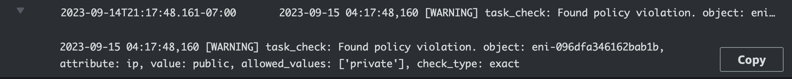

# Gatecheck
As customers develop and deploy containerized applications using Amazon ECS, one of the recurring challenges is how to define and enforce policies on these applications and associated ECS tasks. Policies are conditions on task attributes. For example: 

* Tasks should not have public IPs
* Tasks should not be launched on public subnets
* Tasks should only have container images from approved repositories
* Tasks should (or should not) have ECS execute command access enabled

Gatecheck is an application that evaluates and enforces user-defined policies whenever a new ECS Task is created. Gatecheck is an AWS Lambda based application which is triggered whenever a new task is created. It checks the task attributes against user-defined policies and if there is a policy violation it can take user-defined actions such as post an alert with task and violation details to a slack channel or log the violations to CloudWatch logs.

## Quick start
You will need the following pre-requisites to quickly get started and test Gatecheck.

### Pre-requisites
* [AWS CLI](https://docs.aws.amazon.com/cli/latest/userguide/getting-started-install.html)
* [SAM CLI](https://docs.aws.amazon.com/serverless-application-model/latest/developerguide/install-sam-cli.html)
* An AWS account where you have privilege to create:
    * Lambda function
    * IAM role for Lambda function
    * Eventbridge rule
    * SSM Parameter
    * ECS cluster and task (for testing)

### Getting started
Assuming you have the above pre-requisites, following steps will help you get started and test Gatecheck. Assuming you are on Mac or Linux, open the terminal and apply following commands.

Clone the repository, install `virtualenv`, and activate the virtual environment to install the python based requirements to setup Gatecheck.
```bash
git clone https://github.com/arvindsoni80/gatecheck.git
cd gatecheck
pip install virtualenv
virtualenv .venv
source .venv/bin/activate
```
**Replace the AWS region and AWS account ID with yours.**
```bash
export AWS_REGION=<your-aws-region>
export AWS_ACCOUNT_ID=<your-account-id>
```
Next we will create the AWS IAM role for Gatecheck Lambda function and store the Gatecheck task policy in SSM Parameter. Before we do we need to update the IAM policy file with your account and region that you have set above.

```bash
sed -e "s/<AWS_ACCOUNT_ID>/$AWS_ACCOUNT_ID/g" \
  -e "s/<AWS_REGION>/$AWS_REGION/g" .example_lambda_iam_policy.json > lambda_iam_policy.json

cp .example_task_policy.json task_policy.json
```
We have included a utility called `prereq.py` which uses `boto3` to create the IAM role for Gatecheck function and to create SSM parameter for storing the task policy. The script stores the output values in `.env` file.

```bash
rm .env
pip3 install -r requirements.txt
python3 prereq.py iam -f lambda_iam_policy.json -n gatecheck-lambda-iam-role
python3 prereq.py ssm -f task_policy.json -n ecs-task-policy -r $AWS_REGION
python3 prereq.py extension -f ssm-lambda-extensions.json -a x86_64 -r $AWS_REGION
```
 The above `prereq` commands create and store values in the `.env` file. We will use those values below to generate the SAM CLI config files for your region, account, IAM, and SSM. Then you use the SAM CLI to deploy Gatecheck Lambda function. We will start by unsetting some environment variables just in case they have old values.

```bash
unset GATECHECK_IAM_ROLE
unset GATECHECK_TASK_POLICY_SSM_PARAMETER
unset GATECHECK_SSM_LAMBDA_EXTENSION
unset GATECHECK_ARCHITECTURE

sed -e "s/<AWS_ACCOUNT_ID>/$AWS_ACCOUNT_ID/g" \
  -e "s/<AWS_REGION>/$AWS_REGION/g" .example_samconfig.toml > samconfig.toml

python3 prereq.py sam
```

Now we can deploy the Gatecheck Lambda function using SAM CLI commands

```bash
sam validate
sam build
sam deploy
```

If everything is deployed correctly you will see the Lambda function named `gatecheck` in console under AWS Lambda service and you will see an EventBridge rule named `ecs-task-create` in Amazon EventBridge service.

### Testing 
If you alreayd have an ECS cluster you can test Gatecheck simply by creating an ECS task. If you don't have an ECS cluster then you can use [AWS Copilot CLI](https://aws.github.io/copilot-cli/) to quickly setup an environment and launch ECS tasks. 

Once ECS tasks are created you can check the policy violations (if any) in the AWS console. Go to Lambda service and click on `gatecheck*` function. In the Monitor section click on CloudWatch logs and you will see the policy violations such as below in the log file. 


### Clean up
Use the commands below to remove Gatecheck deployed stack, SSM Parameter, and IAM policies that we just created.

```bash
sam delete
python3 prereq.py cleanup
```


