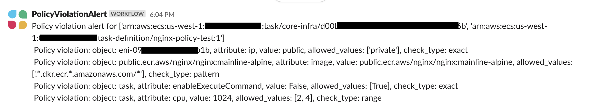
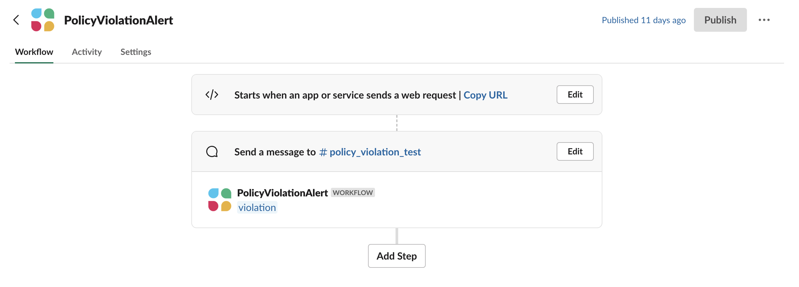
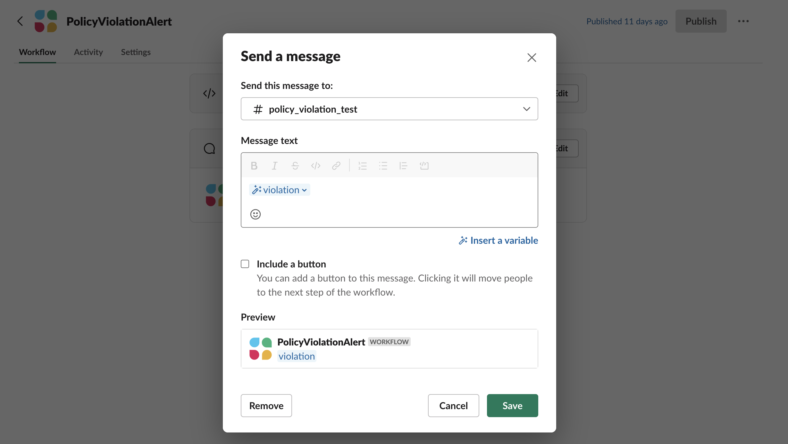

# Gatecheck Alert
Gatecheck can send alerts with all the task and violation details by posting to a webhook. For example, a Slack alert will look like below:


The steps to set this up are:

* In the SAM template file for Gatecheck function add environment variable containing the webhook post url. The environment variable is `ALERT_WEBHOOK`. 
* When you configure the Slack webhook, you can also specify which "key" to extract data from incoming JSON payload. This can be anystring you want for example `{ "violation" : {gatecheck_violation_details} }`. The environment variable `ALERT_KEY` is set to this key value. See the Slack webhook section below. 

Below is the SAM `template.yaml` with the ALERT_WEBHOOK and ALERT_KEY environment variables. Set those variables appropriately to receive alerts on webhook. 
```yaml
 GateCheckFunction:
    Type: AWS::Serverless::Function # More info about Function Resource: https://github.com/awslabs/serverless-application-model/blob/master/versions/2016-10-31.md#awsserverlessfunction
    Properties:
      CodeUri: gatecheck
      Handler: gate_check.lambda_handler
      Runtime: python3.10
      Role: <GATECHECK_IAM_ROLE>
      Environment:
        Variables: 
          PARAMETERS_SECRETS_EXTENSION_HTTP_PORT: 2773
          TASK_POLICY_SSM: <GATECHECK_TASK_POLICY_SSM_PARAMETER>
          ALERT_WEBHOOK: <GATECHECK_ALERT_WEBHOOK>
          ALERT_KEY: <GATECHECK_ALERT_KEY>

```
## Setting Slack Webhook 
Below shows an example of setting up Slack webhook to receive the alert violations. Note the key, `violation`, that is setup to extract the violation data from incoming JSON payload.


