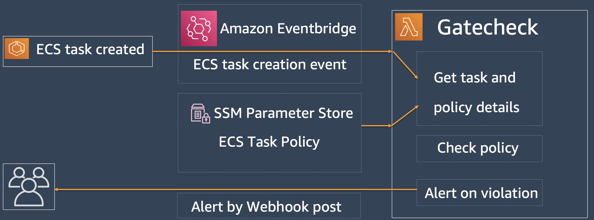

# Overview
Gatecheck enables users to define, check, and enforce policies on ECS tasks. Gatecheck is deployed as a Lambda function. Whenever an ECS task is created, ECS publishes an event to Amazon Eventbridge service. We capture this task creation event and invoke Gatecheck Lambda function. The Gatecheck function then fetches the task details. 

The user-defined task policies are stored in SSM Parameter store. Gatecheck fetches the policies from SSM Parmeter store and evaluates task attributes against these policy statements. If a task attribute has value that is not allowed then it is considered a violation. Gatecheck logs the violation under `WARNING` level in the CloudWatch logs associated with the Lambda function. Gatecheck can also post the violation to webhook such as a Slack webhook.

## Gatecheck IAM policies
Gatecheck reads multiple resources in your AWS account and hence needs read, describe, and list access to variety of resources. 

* CloudWatch logs - This is core requirement for Gatecheck Lambda function to create log group, log stream and put logs. 
* ECS cluster, service, task, and task definition - to get the details for service and task
* Networking resource network interfaces, route tables, security groups, and security group rules - to check for public IP, public subnet, and inspect security group rules.
* SSM parameters - to get the task policy

A sample IAM policy file for the Gatecheck Lambda function is available at [.example_lambda_iam_policy.json](../.example_lambda_iam_policy.json). All resource reading functions are implemented in [get_resource.py](../gatecheck/get_resource.py).

## Deploying Gatecheck with SAM CLI
[The AWS Serverless Application Model (AWS SAM)](https://docs.aws.amazon.com/serverless-application-model/latest/developerguide/what-is-sam.html) can be used to build and deploy the Gatecheck function. SAM CLI needs two configuration files and we provided example for each of them - [.example_samconfig.toml](../.example_samconfig.toml) and [.example_template.yaml](../.example_template.yaml).

The [quick start](../README.md) provides step by step instructions on how to prepare and deploy Gatecheck in your AWS environment. Below is a summary of those steps to help you adapt for your needs.

* Set the AWS_REGION and AWS_ACCOUNT_ID environment variable. This is crucial as these environment variables are used to adapt provided example files to your environment.
* Replace region and account ID in the [.example_lambda_iam_policy.json](../.example_lambda_iam_policy.json) file
* You can use the provided ECS task policy to begin and test [.example_task_policy.json](../.example_task_policy.json)
* Use the provided [prereq.py](../prereq.py) to create the Gatecheck IAM role and store the task policy in SSM Parameter Store. 
* Use the same [prereq.py](../prereq.py) to generate the SAM config files. 
* Then you can use SAM CLI to build and deploy the Gatecheck function. 

